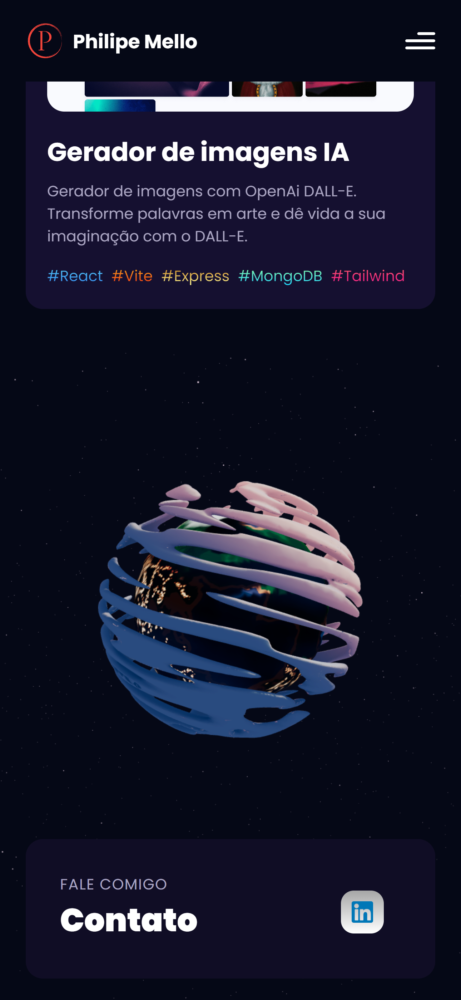

# Portfolio 3D

Projeto Portfolio 3d responsivo feito com o intuito de aprendizado, utilizando React.

## Overview

Os usuários devem ser capazes de:

- Ver todas as seções da página.
- Interagir com os objetos em 3d.
- Enviar emails.

### Screenshots

 - Desktop

 - Mobile

 - Área de Contato

## Tecnologias

### Feito com

- React 18
- Threejs
- Threejs Fiber
- Tailwind CSS
- Vite

## Autor

- GitHub - [Philipe Mello](https://github.com/Philipessj1)
- Link do App - [Portfolio 3D](https://philipe-mello.vercel.app)
